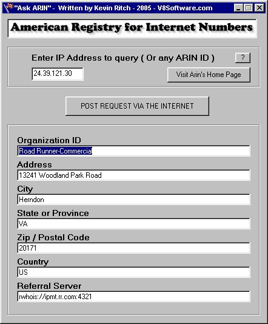

<div align="center">

## VB HTTP POST


</div>

### Description

This software simply demonstrates the use of Windows DLL's to POST data over the Internet and to read back the contents of the returned HTML rather than using the GET equivalent which is less secure.
 
### More Info
 
Enter any American IP Address to look up with ARIN.net

Example use of Basic Code to replace a web browser to POST request data via HTTP and to call the CGI/ASP to process the POST. So, for example, whereas you may normally on a web-page "POST" field data, this Visual Basic application shows you how to do it in pure code, with an easy Form.

Places the results into text boxes

You need to be connected to the Internet to make this work.


<span>             |<span>
---                |---
**Submitted On**   |2005-01-10 15:58:58
**By**             |[Kevin Ritch](https://github.com/Planet-Source-Code/PSCIndex/blob/master/ByAuthor/kevin-ritch.md)
**Level**          |Advanced
**User Rating**    |5.0 (20 globes from 4 users)
**Compatibility**  |VB 5\.0, VB 6\.0
**Category**       |[Complete Applications](https://github.com/Planet-Source-Code/PSCIndex/blob/master/ByCategory/complete-applications__1-27.md)
**World**          |[Visual Basic](https://github.com/Planet-Source-Code/PSCIndex/blob/master/ByWorld/visual-basic.md)
**Archive File**   |[VB\_POST\_HT1838851102005\.zip](https://github.com/Planet-Source-Code/kevin-ritch-vb-http-post__1-58223/archive/master.zip)

### API Declarations

```
Various Internet DLL's
Please note, I did not write the BAS Module, I have written similar ones but this one I researched using Google.
```


